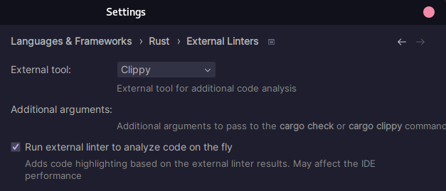
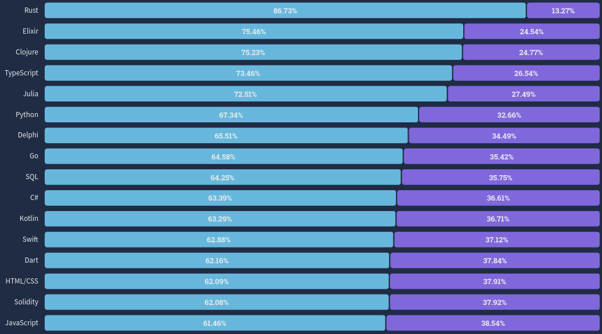

# Advent of Rust
 ― Nøtteknekking med Rust i anledning _Advent of Code_ ―

___

## Kom i gang
[Rust-boka](https://doc.rust-lang.org/book/) er nyttig for alt som har med Rust å gjøre. Start med å kjøre
installasjonskommandoen den foreslår:
```bash
curl --proto '=https' --tlsv1.3 https://sh.rustup.rs -sSf | sh
```

På MacOS kan det være nødvendig å kjøre denne i stedet:

```bash
curl --proto '=https' --tlsv1.2 https://sh.rustup.rs -sSf | sh
```

### Rust plugin i IntelliJ
Dersom du bruker IntelliJ anbefales det sterkt å installere Rust-utvidelsen, og konfigure den slik:



Det kan også være kjekt å ha tilgang til _avlusing_ (eng. *debugging*) om du jobber i IntelliJ. Kjør i så fall
```bash
sudo dnf install llvm-toolset
```
og last ned utvidelsen *Native Debugging Support* fra IntelliJ-markedsplassen.

## Kjøre programmet
Naviger til det aktuelle året, og kjør `cargo run <dag>` med den aktuelle dagen for å beregne svaret for dagens 
oppgave.

## Hvorfor løse _Advend of Code_ i Rust
Rust har i syv år på rad blitt kåret til det høyest elskede programmeringsspråket blant brukerne på Stack Overflow.
I 2022 var det 87 % av Rust-utviklere som sa at de ville fortsette å bruke språket.



Les gjerne:
* [Why the developers who use Rust love it so much](https://stackoverflow.blog/2020/06/05/why-the-developers-who-use-rust-love-it-so-much/)
* [7 Reasons to Use Rust for Your Next Development Project](https://geekflare.com/reasons-to-use-rust/)